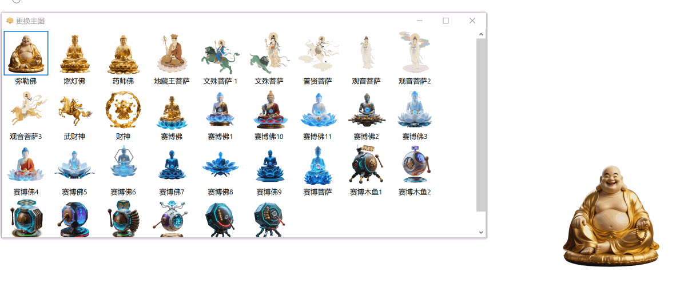
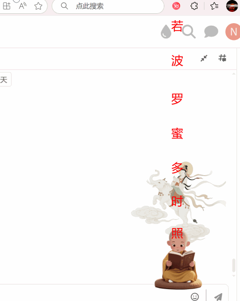
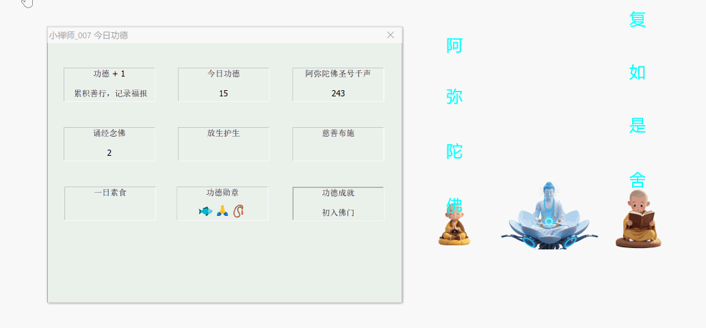
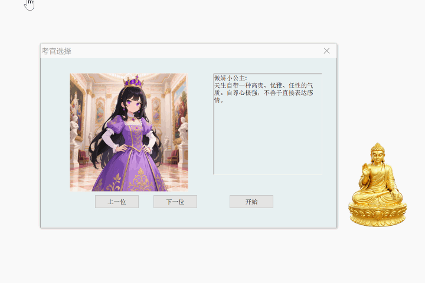

持续更新中。
用阿弥陀佛，念赛博真经.

在您的桌面悬浮一尊佛像

阿弥陀佛 是一款有关佛学类得桌面小工具，有趣味小游戏，念经，赛博转经，传咒语等功能，提供寺庙供奉神仙的小知识。

每天都可以打开电脑赛博上香，添加贡品。念南无阿弥陀佛。也可以赛博转经,转经筒转动。经文念一遍。

工作累了，可以听听弥音，使头脑保持清醒
链接 ：赛博转冈仁波齐 ：  https://noheart2019.github.io/Cyber-Kailash-Game/

基本功能：

图片可根据鼠标滚轮，放大和缩小。

隐藏：佛像不可见。在任务栏中找到图标右键来恢复可见

静心：**“般若波罗蜜多心经”**音乐

梵音：梵音版心经音乐

弥音：钵体的声音。

因果：粤语版三世因果歌音乐

无相：金刚金选篇 凡所有相，皆为虚妄

诵经：念金刚经、心经、阿弥陀佛。动画小和尚在你的桌面每一秒中读出一个字，一直移动到屏幕外。

云游：小和尚在你的桌面走动。到处游走

禅修：<六祖坛经>中的修行佛谒

戒律：五戒图

诵经：小和尚待施主念诵心经，金刚经，阿弥陀佛。文字会上升到屏幕外。经文速度和文字上升速度可通过界面来设置

转经: 鼠标悬浮播放唵嘛呢叭咪吽音乐。双击显示文字

传咒：阿难尊者传咒,文殊菩萨心咒\观音菩萨心咒\阿弥陀佛心咒\莲花生大士心咒

贡品：香客常待得贡品，桃，苹果，葡萄。

换肤：将佛陀图像换成菩萨图像。

敬香： 敬香GIF。

其他：

鼠标悬停 持续念佛号。双击左键 显示 “功德+1”

托盘菜单

打赏：打赏作者0.99元。

今日功德：显示你今天的功德数。小和尚代你念经的变数

趣味 ： 趣味小和尚，动作目前包含奔跑、吃苹果、吃桃子、打坐、摸鱼、诵经动画。双击左键播放下一个动作，右键动画消失。
				天降甘霖。从屏幕掉落一堆代表情得水果。
				灭三毒，介绍三毒的基本信息。双击图片消失
				心经考核 检擦你对心经得背诵和研究
				
四大天王：四大天王得简介

菩萨坐骑：介绍普贤菩萨，观音菩萨，地藏王菩萨，文殊菩萨坐骑，可以通过点击让坐骑移动起来。
	

功德+1

换肤

诵经

赛博转经。

阿难尊者传咒

查看今日功德

寺庙供奉的神仙介绍

财神:

趣味游戏：

天降甘霖：

小和尚摸鱼

小卓玛

灭三毒

心经考核:

赛博转冈仁波齐:

财神送福:

