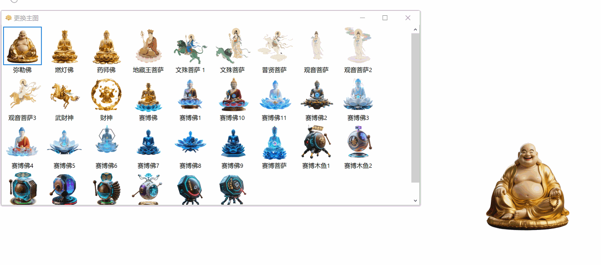

用阿弥陀佛，念赛博真经.

全面升级啦。

在您的桌面悬浮一尊佛像。

阿弥陀佛 是一款有关佛学类的桌面小工具，有佛音，念佛，念咒，念经，转经，放生，布施，今日守戒，整点报时等功能，提供寺庙供奉神仙的小知识。
并提供修行记录功能，把每天念诵经文、咒语，积累的功德全部记录下来方便用户查看修行进度。
每天打开电脑就可以上香，添加贡品，供灯。念南无阿弥陀佛。也可以转经,转经筒转动。经文念一遍。精进佛法。早日涅槃。
用户也可以利用此软件，打造自己的佛学修行助手。

核心功能：

佛音：
	
	提供多种和佛学相关的音乐。支持用户自定义添加。

念佛：
	
	记录今天念阿弥陀佛的次数。

念经:
	
	念大悲咒，每点击一次按钮，出现一句大悲咒的咒语，直到结束。

诵经:
	
	小和尚帮施主念诵经文。支持用户自定义添加，注意经文格式必须使UTF-8格式。

禅师：

	快速方便的访问DeepSeek网站，遇事不决问DeepSeek。

行善:

	放生鱼, 布施小和尚，一日素食

木鱼功能：

	鼠标移动到主图上，会有“南无阿弥陀佛”提示。并播放南无啊弥陀佛音乐。移开则停止。滚轮放大和缩小图片。也提供隐藏/显示功能。

  鼠标双击显示“功德+1”，积累功德，累计福报。

  支持用户自定义。

基本功能：

佛音：
静心：**“般若波罗蜜多心经”**音乐
梵音：梵音版心经音乐
弥音：钵体的声音。
因果：粤语版三世因果歌音乐
无相：金刚金选篇 凡所有相，皆为虚妄
戒律：五戒图
诵经：小和尚待施主念诵心经，金刚经，阿弥陀佛。文字会上升到屏幕外。经文速度和文字上升速度可通过界面来设置
转经: 鼠标悬浮播放唵嘛呢叭咪吽音乐。双击显示文字
念咒：咒语计数器:文殊菩萨心咒\观音菩萨心咒\阿弥陀佛心咒\莲花生大士心咒
贡品：香客常待得贡品，桃，苹果，葡萄。
敬香： 敬香GIF。
放生: 放生鱼
素食：一日素食
	

敬香

佛音:

念经:

念咒:

诵经:

今日守戒:

修行记录:

素食:

设置:

转经。

换肤

寺庙供奉的神仙介绍

小和尚摸鱼

小卓玛

寺庙介绍

